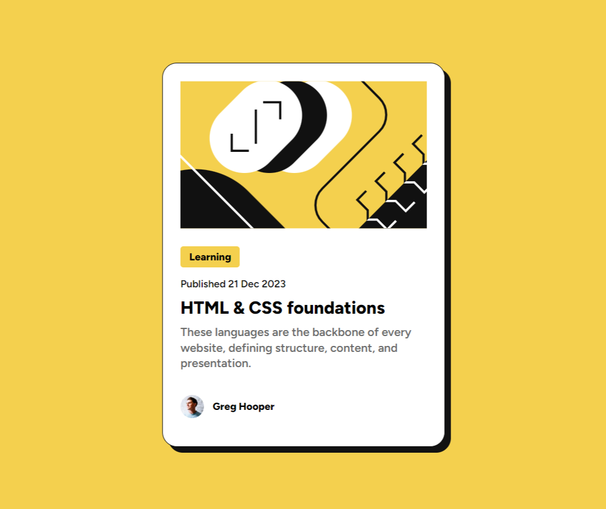

# Frontend Mentor - Blog preview card solution

This is a solution to the [Blog preview card challenge on Frontend Mentor](https://www.frontendmentor.io/challenges/blog-preview-card-ckPaj01IcS). Frontend Mentor challenges help you improve your coding skills by building realistic projects. 

## Table of contents

- [Overview](#overview)
  - [The challenge](#the-challenge)
  - [Screenshot](#screenshot)
  - [Links](#links)
- [My process](#my-process)
  - [Built with](#built-with)
  - [What I learned](#what-i-learned)
  - [Continued development](#continued-development)
- [Author](#author)

## Overview

### Screenshot

### Links

- Live Site URL: [Add live site URL here](https://alfonsovidrio.github.io/blog-card-component/)

## My process

### Built with

- Semantic HTML5 markup
- CSS custom properties
- Flexbox

### What I learned

Design with Flexbox: I learned how to use Flexbox to simplify the process of aligning and distributing elements within a container, making the design more fluid and flexible.

### Continued development

In future projects, I will focus on improving my advanced CSS skills, such as using CSS Grid to complement Flexbox and create more complex layouts. I also plan to refine my CSS coding practices by concentrating on modularity and implementing methodologies like BEM for better organization and maintainability. Additionally, I aim to delve into performance optimization techniques and ensure that my designs are fully responsive and accessible, applying best practices for web accessibility.

## Author

- Frontend Mentor - [Alfonso Vidrio](https://www.frontendmentor.io/profile/AlfonsoVidrio)
- LinkedIn - [Alfonso Manuel Vidrio Lizaola](https://www.linkedin.com/in/alfonsomanuelvidriolizaola?originalSubdomain=mx)
